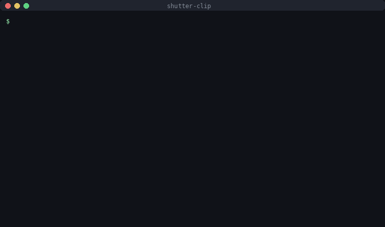

# shutter-clip

[](https://github.com/keivanmalhani/shutter-clip/actions/workflows/ci.yml)


English | [Espanol](README.es.md)



Zero-edit social clips straight from a footage drive. Point it at the SSD,
get phone-ready files you can AirDrop and post as-is. Nothing is uploaded
anywhere and source files are never touched.

Part of the shutter-* family (shutter-cull, shutter-mcp). Phase 0 of the
social clip engine.

## Requirements

- ffmpeg and ffprobe on PATH. macOS: `brew install ffmpeg`
- python3 (stdlib only, no pip installs)

## Quick start

```zsh
python3 shutter_clip.py scan "/Volumes/Crucial X10"
```

```zsh
python3 shutter_clip.py mirror "/Volumes/Crucial X10"
```

Outputs land in `_phone-ready/` on the drive, mirroring the folder layout.
Folders whose name contains "do not include" or "do not use" are always
skipped, plus anything passed via `--exclude`.

## Subcommands

| command | what it does |
| --- | --- |
| `scan` | inventory: codec, resolution, fps, duration, HDR / 10-bit / flat-profile / no-audio flags |
| `mirror` | 1080p phone-ready copy of every clip into `_phone-ready/library/`. Incremental |
| `publish` | motion-ranked best moments from long videos, readable names, organized into platform packs by content type |
| `rank` | deep-rank moments using shutter-select's analysis: speech, audio quality, sharpness, motion, exposure |
| `clips` | plain auto-cut into 6-18 s pieces at scene changes (dumb version of publish) |
| `sheet` | self-contained HTML contact sheet. Click frames to build a picks list |
| `cut` | export the exact moments listed in a picks file |
| `frames` | 3-frame review strips for every published pick, numbered for quick verdicts |
| `curate` | apply `0012 kill` / `0007 top 3` verdicts: b-sides out, top picks front |

## publish

One analysis decode per video builds a motion profile (per-frame scene
score plus average luma). Candidate windows are ranked by motion energy,
down-weighted near the first/last 8 percent (drone takeoff/landing) and
in dark stretches, and never straddle a hard cut. Top 1-4 non-overlapping
moments per video (scales with duration) are exported horizontal plus a
9:16 vertical twin:

```text
_phone-ready/post-ready/
  tiktok + reels/
    drone aerials/brazil drone footage - pick 1 of 2 - 14s - DJI_0596 at 1m00s - horizontal.mp4
    camera footage/...
    phone clips/...
  shorts + stories - vertical/
    ...same moments as vertical crops
```

Content type comes from filename patterns (DJI = drone, DSCF/C0xxx =
camera, IMG = phone) with folder-name fallback.

## rank

`publish` sees motion and brightness. `rank` sees everything
[shutter-select](https://github.com/keivanmalhani/shutter-select) can
measure: speech takes and what was said, audio quality, sharpness,
exposure, motion, optional face presence. shutter-clip stays
stdlib-only: it never imports shutter-select, it reads the per-file
analysis JSON (schema 1) that `shutter-select analyze` caches under
`_selects/cache/`, and `--analyze` runs that CLI as a subprocess when
the cache is missing or stale.

```zsh
python3 shutter_clip.py rank "/Volumes/Crucial X10" --analyze
```

Segments are re-scored with social weights (motion and hook energy
count for more than interview polish), percentile-ranked within their
class across the whole run, and windowed to postable lengths per
content type (drone 20 s, camera 12 s, phone 8 s, `--clip-len`
overrides). Distorted or inaudible speech and sub-`--min-len` scraps
are excluded with plain-English reasons. Everything lands in
`_phone-ready/rank/`:

- `picks.txt`: best moments first, ready for the cut command:
  `python3 shutter_clip.py cut _phone-ready/rank/picks.txt ROOT`
- `report.txt`: the full ranking plus every exclusion and its reason
- `ranking.json`: scores, features, and transcripts for every segment,
  the input for the caption and scheduling phases

If shutter-select is not installed, `rank` says so and prints the exact
analyze command to run; nothing is downloaded or imported silently.

## Output format

- Horizontal 1920x1080 is the default. `--vertical` adds a 1080x1920
  center crop, `--vertical-only` replaces.
- HEVC with the `hvc1` tag: half the size of H.264, native on iPhone.
  Encoder is picked automatically: VideoToolbox hardware on macOS
  (about 5-10x realtime), libx265/libx264 elsewhere. Override with
  `--encoder x264` if any player complains.
- HLG/PQ HDR sources are tone-mapped to SDR bt709 automatically.
- Log footage: pass `--lut yourlook.cube` to bake in a look.

## Picking exact moments

```zsh
python3 shutter_clip.py sheet "/Volumes/Crucial X10"
```

Open `_phone-ready/contact-sheet.html`, click the frames you like, hit
Copy picks, save as `picks.txt`, then:

```zsh
python3 shutter_clip.py cut picks.txt "/Volumes/Crucial X10"
```

Pick lines look like `folder/clip.MOV @ 1:42` (12 s from there),
`... @ 1:42-1:55` for an exact range, trailing ` v` for vertical.

## Development

```zsh
python3 -m pytest tests/ -q
```

62 tests, no committed media: fixtures are rendered with ffmpeg at run
time (x264 ultrafast, tiny frames). The suite covers the motion scorer
(edge damping, dark penalty, cut boundaries, start-spike clamp), the
plain-english naming and exFAT sanitizing, content buckets, segment
splitting, the whole rank stage (tie-averaged percentiles, social
weights, skip reasons, the shutter-select cache contract), and real
ffmpeg round trips for scan, cut, and clips --copy. CI runs it all on
every push.

## Notes

- `clips --copy` stream-copies the original 4K with zero quality loss and
  near-zero time, but cuts snap to keyframes, so starts can be off by a
  second or two. Default mode re-encodes and is frame-accurate.
- `clips` decodes every file for scene detection. On a big drive expect
  minutes on Apple Silicon, much longer without hardware decode.
- `scan` samples one frame per file for the flat-profile guess.
  `--fast` skips that.

## License

MIT, see [LICENSE](LICENSE).
